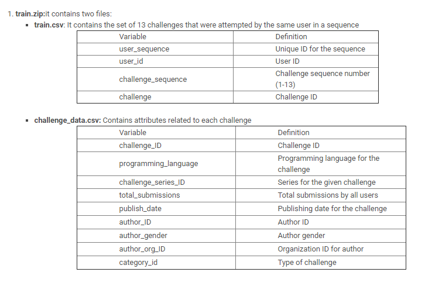
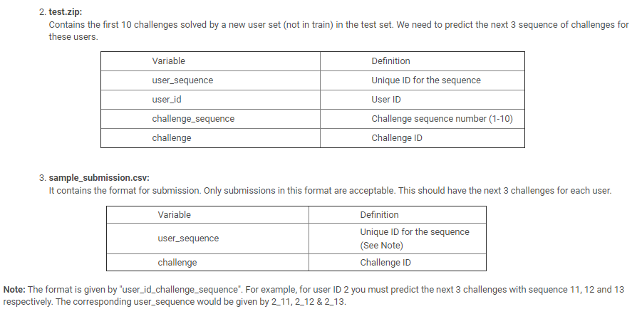
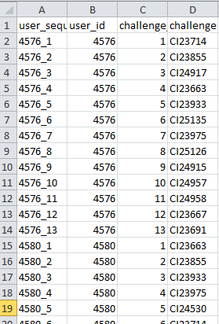
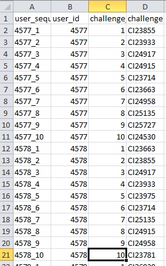

# JanataHack-Recommendation-Systems
**Solution for JanathaHack: Recommendation System** \  
The client has provided you with history of last 10 challenges the user has solved, and you need to predict which might be the next 3 challenges the user might be interested to solve. Apply your data science skills to help the client make a big mark in their user engagements/revenue.
  
## Data Description at a Glance

## Train Data at a Glance

## Test Data at a Glance

## Challenge Data at a Glance

## Description of my Methodologies
### Approach
#### 1. Initial Try with LSTM
- Taken a Text Generation Approach and tried training with each sequence combination Ex: for sequence (1,2,3,4,5,6...10) I have taken taken combinations of (1,2-->3), (1,2,3-->4), (1,2,3,4-->5)... 
- This Approach gave me a score of 0.05 map which is very less to start with.
#### 2. Turicreate API
- After Lot of effort in LSTM(which i couldnt improve) i searched how else can we solve this problem and found that turicreate API works very well with out any actual training. It is suggested to use this API for quick and better solutions of recommendation [Link to Turicreate](https://apple.github.io/turicreate/docs/api/turicreate.toolkits.recommender.html)
- Using Turicreate Itemsimilarity recommender gave me a score of 0.2011 map.
#### 3. LSTM Again
- Not satisfied with the 0.201 score and again tried various approaches of input data.
- Finally FinalLSTM.py approach worked , check it [Here](https://github.com/saikrithik/JanataHack-Recommendation-Systems/blob/master/FinalLSTM(0.271).ipynb)
#### Tools used
1. Python for programming
2. pandas and numpy libraries for methodology
3. Tensorflow and keras library for the model
4. matplotlib and seaborn was used for plotting and analyzing the data
#### Competition Result
Rank: 5th on public LB and __ on private LB\
[Link](https://datahack.analyticsvidhya.com/contest/janatahack-recommendation-systems/#LeaderBoard)
